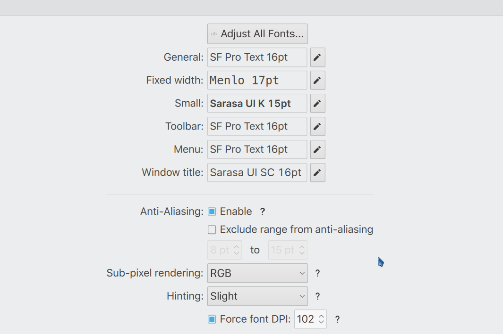
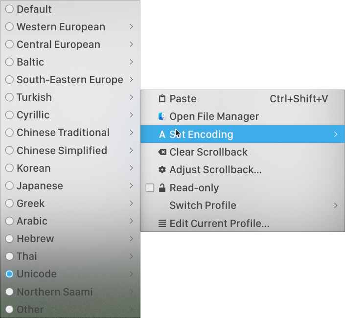

# kde-config
This is my own linux kde plasma quick configurations. Kde is a nice desktop choice which has various fabulous styles. This document has many languages but it's a whole document that's not separated by languages.給出的字體文件之保留作爲自己方便遷移環境時候下載。之後如果有能力將擴展更多語言作爲文檔語言。作爲系統發行版本選擇，Manjaro 個人認爲比 openSUSE 更加方便使用。AUR 軟件源十分豐富而且速度很快，不需要像 zypper 每次安裝都要加載刷新已經存在的源很慢。Mein name ist Leyls. Sehr danke!

## English
**This is a configuration guidance if you are using kde as linux desktop solution. It's personal, not granted for anything like speed or fluency.** This part is more about apperance. Steps are as follows.
* Font. Configure font in **System Settings > Apperance > Fonts**(In different linux distributions, you may use different global configurations. For example, in Manjaro, use `/etc/fonts/local.conf` or `/etc/fonts/conf.d/*` to make a personal configuration. But here, System Settings is just a convenient, quick and visual choice.)

The names of the fonts are:
    * San Francisco Display Medium (replacements: SF Pro Display, SF UI Text)
    * Sarasa Gothic K
    * PingFang SC
    * Menlo
    * Monaco
* In **System Settings > Apperance**:
  * Application Style. It decides the menu style. Here provides only one note: Set the transparency to **30%** or **40%**.

  * Plasma Style. Use **Future**. Download it from **Get New Plasma Style**.
  * Colors. This may change very frequently. You can customize your own color sheet from **Breeze Light**.
  * Window Decorations. Use **Breeze Blur** or **Genome L. Blur Flat**. Just remember, make the window title bar **BLUR**. Some other options have been listed below:
      * Freeze
      * McMojave, just like mac, have a lithe window effect.
        
      If you want more information about window decorations, go to directory : `/home/name(my user name)/.local/share/auroare(just my folder name, best way is to search it)/themes/theme name`. In this folder you will discover multiple `.svg` or `.svgz`(a kind of compression format of `.svg`) files. You can edit `.svg` files directly via kate. `KDE` reads the `.svg` format to paint and display which means you can customize the values or write your own( and in Settings > Window Decorations click `Install From File`). **Compare different `.svg` together to understand the grammar and customize existed theme or make your own one.**
  * Icons. **Mkos-BigSur-Light**. 
  * Splash Screen. **None**.
* In **System Settings > Workspace > Workspace Behaviour**
  * General Behaviour > Animation Speed. **9/16**.
  * Desktop Effects > Apperance. **Fall apart, Fading Popups, Woobly windows, Magic lamp**
* In **System Settings > Hardware > Display and Monitos**
  * Night Colour. **Always On**. **3700K**.
* Back to Desktop. Right click to **Edit Panel**.
  * Make bottom panel and top panel.
  * Bottom panel height **82**. Add **Icon Only Task Manager**. Add two **Panel Spacer** to make task manager be the middle. Order: Panel Spacer + Icon Only Task Manager + Panel Spacer. Make panel **Auto-Hide**.
  * Top panel height **32*. **Application Menu + Global Menu + Panel Spacer + Search + Networks + Battery + Digital Clock (Fuzzy Clock)**. 

## 繁體中文
主要來說，配置字體最麻煩的是中文字體顯示，所以這部分使用中文。按照上述的英文字體方案，安裝完全部字體後，中文字體推薦使用兩種字體，分別是 PingFang SC 和 Sarasa Gothic K（Sarasa 更紗黑體有很多類型，這裏的 Gothic K 屬於中等間距而且英文顯示尚可）。一般字體分爲拉丁字符和非拉丁字符。除去部分語言，例如泰語，阿拉伯文或者一些東南亞小國非洲語言（這些語言結構特殊，非漢字結構字符，而日文，簡體，繁體均屬於漢字結構），可以使用的字體配置如下：
* 拉丁字符，主要分爲 Serif，Sans-Serif 和 Mono，中文含義爲有襯線，無襯線和等寬，分別常用於閱讀，顯示和編程使用。
   * 襯線一般用 Times New Roman，Leyls 對此研究較少，這裏不多說明。襯線字體一般是爲了增加排版複雜度，能夠吸引用戶注意力，所以常常用默認的閱讀字體。
   * 無襯線可使用 Helvetica 和 San Francisco 系列字體，對於扁平化有特別喜愛或者有半襯線顯示需求的可以使用 Cabin 。BBC 字體也很不錯，其差異主要反映在 a，s，h 等字母的曲線彎曲程度上。曲線越彎一般顯示的閱讀效果很好但是若用於系統顯示則會感覺很髒。
   * 等寬字體一般用 Monaco，Monospace，Menlo 和 Fira Code（這也對應了目前主流的集中類型編程字體，分別是打字機模擬類，或者顯示類，也就是沒有過於明顯的轉角）。
* 漢字結構字符使用上面說的兩種字體均可，顯示效果而言簡體更適合 PingFang SC， 繁體更適合 Sarasa Gothic K，另外，思源黑體和冬青黑體顯示效果也尚可，前者屬於谷歌開源字體，對大量字符均有支持。
* 字體中英文混合顯示需要分別保持登高和等寬，一般兩者只能保證其一，優先選擇等寬。Linux 中常常用文泉驛（小米黑或者黑體），顯示效果常常很模糊並且有鋸齒，另外，中文環境下顯示常常將拉丁字符和數字顯示爲全角字符，不變於閱讀。需要自行配置。全局字體推薦使用 Sarasa Gothic K 或者 PingFang SC。附件的 `conf.d` 和 `local.conf` 屬於 `/etc/fonts/` 目錄下。有些部分的字體需要單獨設置例如 Firefox 瀏覽器字體配置。
 
下面是其他主題/配色或者輸入法配置，顏色配置具有很多原則，參見 `colors` 文件夾。
* Kate 的配色方案。參見附件 `Nat.theme`。在 Kate 中 Configure Kate 然後在 Color Theme 中導入該配色配置文件即可。字體選擇 Monaco 17 或者 Monaco 16。一般其他插件需要安裝或者顯示 File System Browser, Preview。
* 輸入法配置。請安裝使用 Fcitx。然後安裝 fcitx-rime。附件給出的 `rime` 文件夾應該放在 `~/.config/fcitx/` 目錄下。注意主題配置文件不在此目錄，配置主題和部分設置例如快捷鍵（這裏推薦使用 Alt-Space ）可以使用 fcitx-configtool（需要單獨安裝）。
* visual studio code 配置。該文本編輯器使用較少，但是功能很多。配色主題使用 Brackets Light Pro，字體使用 Monaco 和 PingFang SC。文件圖標和其他圖標使用 Fluent Icon/UI。安裝 code runner， 在設置中配置 run in terminal。也可以安裝 `emacs` 插件使用 emacs 快捷鍵。
* emacs 配置。該配置並沒有很好解決中文顯示問題。主要用於保存一些配色和主題文件。參見 `Themes/cloud-theme.el` 文件夾。
* zsh，可以通過 `prezto` 這個配置框架。

